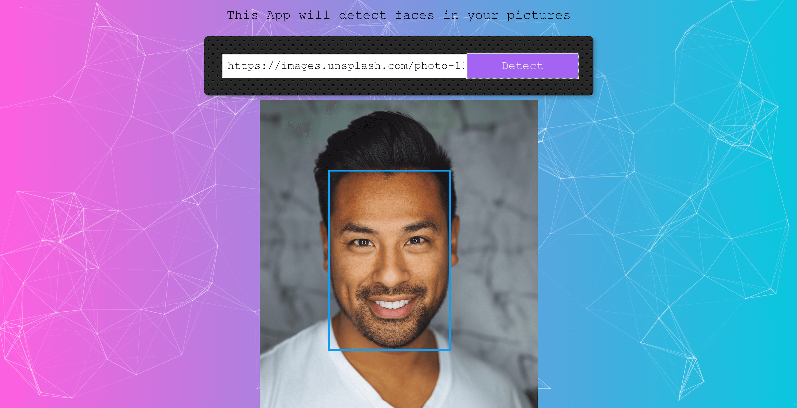

# react-face-detection-app-frontend

## Overview

Full-stack React app with Node.js Server on the backend, postgres database with React
Hooks to manage our state (replacing Redux!), with vision AI using Clarifai Api and more.

This application is a face detection app where users can upload images and detect faces in those
images. The backend for the app is [node-face-detection-app-backend](https://github.com/heminjohnson/node-face-detection-app-backend)

## Installation

Clone this repository and run

```javascript
yarn
```

To start server

```javascript
yarn start
```

## ENVIRONMENT VARIABLES

Keys and other sensitive details are not stored on Github. Before starting the app create a `.env` file and add the API KEY:

`REACT_APP_CLARIFY_API_KEY=[YOUR_CLARIFY_API_KEY]`<br/>
`REACT_APP_BACKEND_URL=[YOUR_BACKEND_SERVER_URL]`

### View [working demo](https://face-detection-app-frontend.herokuapp.com/)

> Note: This app is hosted on Heroku free tier. If currently in 'sleep mode' the initial request time may take longer.
> Subsequent requests will perform normally.

<br>


